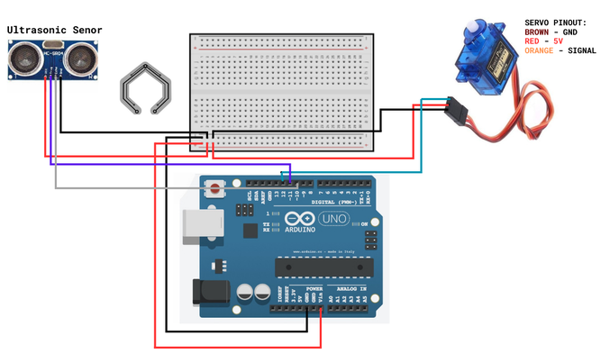

# 📡 DIY Arduino Ultrasonic Radar System

## 📝 Overview
This project is a functional, miniature radar system that actively scans its environment and visualizes detected objects on a computer screen in real-time. By combining a microcontroller, an ultrasonic sensor, and graphical processing software, the system provides a sweeping green radar display reminiscent of traditional sonar screens.

## ✨ Features
*   **Active Scanning:** A servo motor sweeps the sensor continuously from 15 to 165 degrees[cite: 2].
*   **Distance Measurement:** Calculates the precise sound wave travel time in microseconds to determine object distance[cite: 2].
*   **Visual Interface:** A custom GUI built in Processing that draws a radar arc, highlights objects in red if they are within the 40 cm detection range, and flags them as "In Range" or "Out of Range"[cite: 1].
*   **Serial Communication:** Seamless data string parsing between the hardware and the PC interface using a custom indexing protocol (sending `angle,distance.`)[cite: 1, 2].

## 🛠️ Hardware Setup & Circuit Diagram
The hardware integration is straightforward, relying on standard jumper connections to the microcontroller.

### Pin Mapping
| Component | Pin Function | Arduino Pin |
| :--- | :--- | :--- |
| **HC-SR04 Ultrasonic Sensor** | Trig | Digital Pin 10[cite: 2] |
| | Echo | Digital Pin 11[cite: 2] |
| **Servo Motor** | Signal | Digital Pin 12[cite: 2] |

*(Note: Both the sensor and the servo require 5V and GND connections as shown in the diagram).*

## 💻 Installation & Usage

### 1. Arduino Setup
1. Open the `.ino` file in the Arduino IDE.
2. Ensure the `<Servo.h>` library is included[cite: 2].
3. Connect your board, select the correct COM port, and upload the code. 

### 2. Processing (GUI) Setup
1. Download and install [Processing](https://processing.org/).
2. Open the `.pde` file in the Processing IDE.
3. **Crucial Step:** Check your Arduino's COM port in the Arduino IDE. In the Processing code, locate the `setup()` function and ensure the `Serial` object matches your specific port (e.g., `"COM5"`)[cite: 1].
4. Run the Processing sketch. A 1200x700 resolution window will open displaying the radar sweep[cite: 1]. 

## 👨‍💻 About the Developer
This repository is maintained by Sathwik, an Electronics and Communication Engineering student. It serves as a practical demonstration of integrating embedded hardware systems with real-time software visualization.